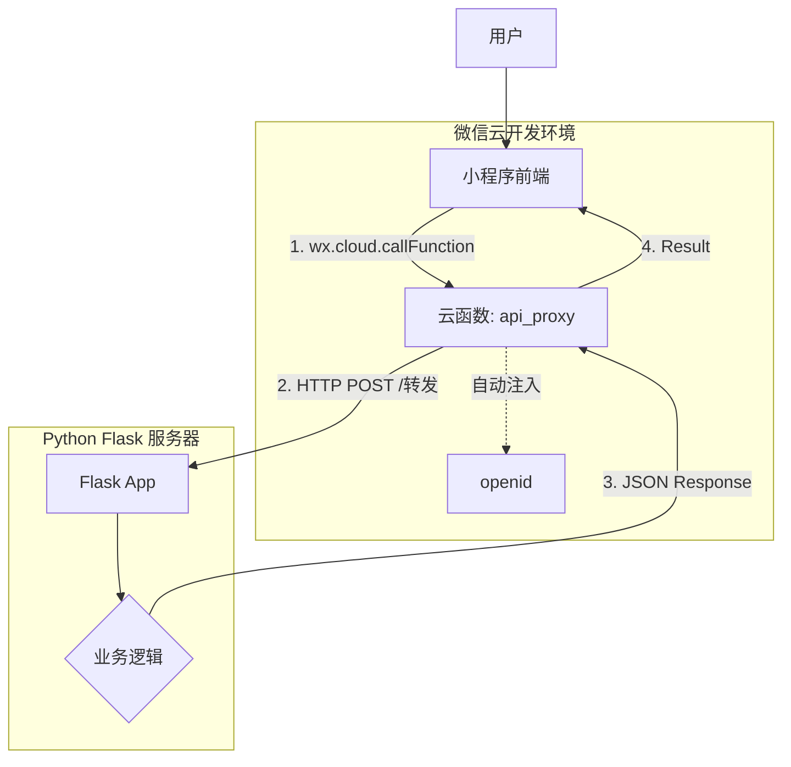

# 微信小程序与 Flask 混合架构开发指南

本文档详细说明了如何开发、部署和维护这个微信小程序项目。项目采用了 **混合架构**，利用微信云函数作为安全网关，将请求转发至 Python Flask 后端。

## 1. 系统架构



### 核心组件
- **Miniprogram (前端)**: 原生小程序，负责界面交互。
- **Cloud Function (网关)**: `api_proxy` 云函数，负责鉴权（OpenID）和请求转发。
- **Flask Server (后端)**: 运行在你的服务器上，处理所有业务逻辑（数据存储在内存中演示）。

---

## 2. 目录结构说明

```text
小程序/
├── cloudfunctions/           # 云函数目录
│   └── api_proxy/            # [核心] 转发请求到 Flask 的代理函数
├── miniprogram/              # 小程序前端代码
│   ├── pages/
│   │   ├── home/             # 地图主页 (路线选择、定位)
│   │   ├── checkin/          # 打卡与商店 (任务列表、积分兑换)
│   │   ├── community/        # 社区 (发帖、点赞)
│   │   └── profile/          # 个人中心 (用户信息、积分统计)
│   ├── app.json              # 全局配置 (TabBar, 页面路由)
│   └── envList.js            # 云环境配置
└── server_api/               # [后端] Python Flask 服务端代码
    ├── app.py                # 核心业务逻辑
    └── requirements.txt      # Python 依赖
```

---

## 3. 快速开始与部署

### 步骤 A: 启动 Python 后端
1. 将 `server_api/` 文件夹上传到你的服务器（或本地运行）。
2. 安装依赖：`pip install -r requirements.txt`
3. 启动服务：`python app.py`
   - 确保服务器防火墙放行 5000 端口。
   - 确保拥有公网 IP（如果是本地调试，需使用内网穿透工具如 ngrok）。

### 步骤 B: 部署云函数
1. 打开 **微信开发者工具**，导入 `小程序` 文件夹。
2. 在 `cloudfunctions/api_proxy/index.js` 中，修改 `FLASK_SERVER_URL` 为你的 Python 服务器地址。
3. 右键点击 `cloudfunctions/api_proxy` -> **"上传并部署：云端安装依赖"**。

### 步骤 C: 运行小程序
1. 在开发者工具中编译运行。
2. 你应该能看到地图、打卡任务列表等数据，这些数据都是从 Flask 实时获取的。

---

## 4. 架构迁移指南 (Python -> 云开发)

如果你希望未来摆脱 Python 服务器，完全使用微信云开发（云数据库、云函数），请遵循以下迁移路径：

### 代码中的迁移标记
搜索代码中的 `[MIGRATION_NOTE]` (后端) 和 `FUTURE_CLOUD_FUNC` (前端) 注释。

### 具体迁移步骤

#### 1. 数据库迁移
| Python 内存数据 | 微信云数据库 Collection | 字段设计建议 |
| :--- | :--- | :--- |
| `users_db` | `users` | `_openid`, `nickname`, `points`, `level` |
| `posts_db` | `posts` | `_openid`, `title`, `content`, `likes`, `createTime` |
| `products_db` | `products` | `name`, `price`, `image` |

#### 2. 前端调用替换
目前前端统一使用 `callCloudApi` 方法调用代理。迁移时，直接修改业务代码：

**示例：获取帖子列表**
*   **当前 (Python 模式):**
    ```javascript
    this.callCloudApi('/api/community/posts', 'GET')
    ```
*   **未来 (云开发模式):**
    ```javascript
    const db = wx.cloud.database()
    db.collection('posts').orderBy('createTime', 'desc').get()
    ```

#### 3. 后端逻辑迁移
将 `server_api/app.py` 中的业务逻辑（如积分扣减、打卡校验）移动到新的云函数中（例如创建一个 `shop_service` 云函数处理兑换逻辑）。

---

## 5. 常见问题

*   **Q: 为什么小程序报错 "与之通信的服务器未响应"?**
    *   A: 请检查 `cloudfunctions/api_proxy/index.js` 中的 URL 是否正确，以及 Python 服务器是否正在运行且公网可访问。
*   **Q: 需要配置 request 合法域名吗?**
    *   A: 不需要。因为请求是由云函数发出的，云函数访问外网不受小程序域名白名单限制。

---

**祝开发顺利！**

