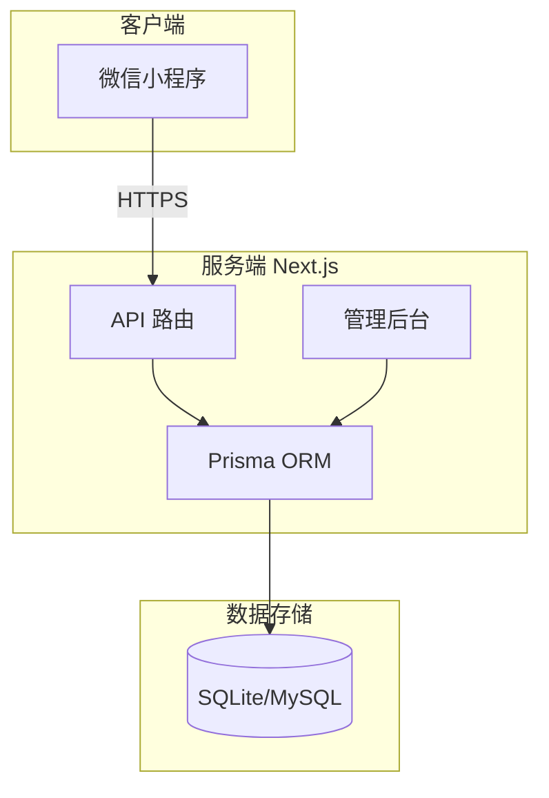

# 📱 WeChat MiniProgram Fullstack Project

这是一个基于 **Next.js 全栈架构** 的微信小程序项目，集成了小程序前端、后端 API 服务以及可视化的运营管理后台。

👉 **[查看详细架构文档 (Architecture Docs)](docs/ARCHITECTURE.md)**

---

## 🏗️ 核心架构 (Core Architecture)



> *注：如上方图表无法显示，请安装 Mermaid 插件或查看 `docs/` 目录下的文档。*

---

## 🚀 快速开始 (Quick Start)

### 1. 启动后端 (Server)
核心代码位于 `server_next` 目录。

```bash
cd server_next
npm install
npx prisma db push
npx prisma db seed
npm run dev
```
后台地址: [http://localhost:8080/admin](http://localhost:8080/admin)

### 2. 启动小程序 (Frontend)
导入 `miniprogram` 目录至微信开发者工具，勾选“不校验合法域名”。

---

## 📂 目录结构

| 目录 | 说明 |
| :--- | :--- |
| `miniprogram/` | 小程序前端源码 |
| `server_next/` | **[推荐]** Next.js 全栈后端 (API + Admin) |
| `server_api/` | [归档] 旧版 Flask 后端 |
| `docs/` | 项目文档与架构图 |
