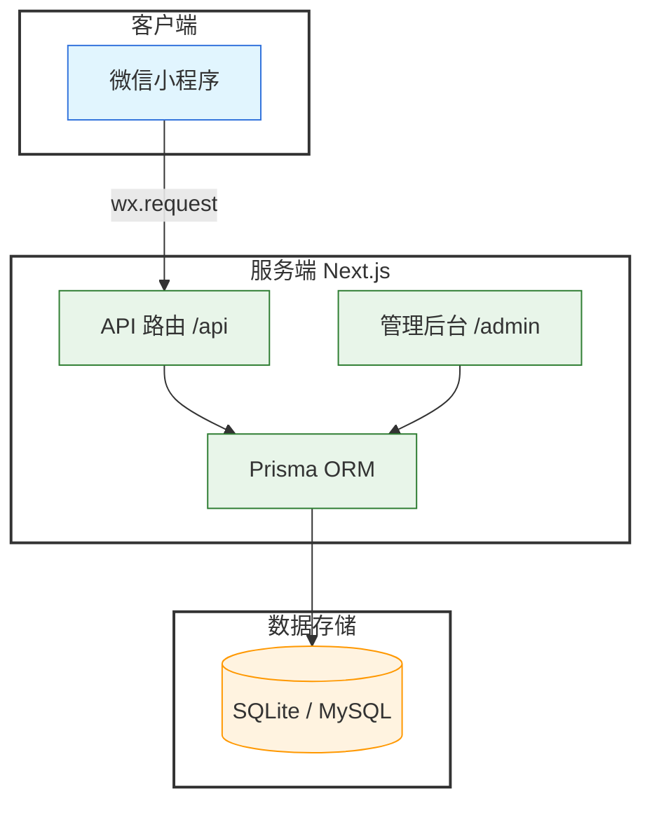
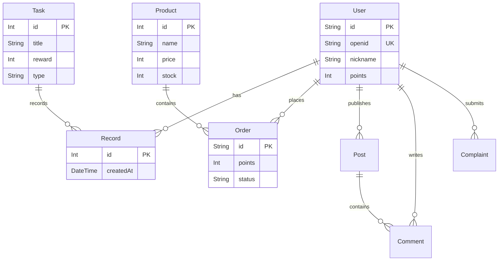

# 🏗️ 系统架构详情 (System Architecture)

本文档详细描述了微信小程序全栈项目的内部架构、数据流向及设计决策。

## 1. 核心架构图 (Architecture Overview)

### 🔍 模块交互详解

1.  **客户端 (Client)**
    *   **Miniprogram**: 负责 UI 渲染、用户交互、微信能力调用（如定位、登录）。
    *   不直接操作数据库，所有数据通过 HTTPS 请求发送给服务端。

2.  **服务端 (Server)**
    *   **Next.js App Router**: 托管在 Node.js 环境中。
    *   **API Routes**: 处理业务逻辑（如积分计算、订单生成）。
    *   **Admin Dashboard**: 提供给运营人员的 Web 界面。

3.  **数据层 (Data)**
    *   **Prisma**: 类型安全的 ORM，作为代码与数据库的桥梁。
    *   **SQLite**: 开发环境使用的轻量级数据库文件（`dev.db`）。

---

## 2. 数据库模型 (Entity Relationship)

## 3. 关键业务流程

### 3.1 每日打卡
用户在小程序点击打卡 -> 获取地理位置 -> 后端校验距离与重复 -> 写入 Record -> 增加积分。

### 3.2 积分兑换
用户选择商品 -> 后端校验库存与积分 -> 开启事务(扣分/扣库存/生成订单) -> 返回结果。

